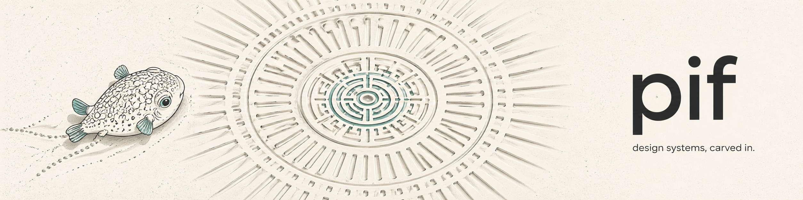

<p align="center">
  
</p>

# pif

A [pi](https://pi.dev) package that creates and enforces frontend design style guides. `pif` turns the design-system blueprint in this repo into a project-local `docs/styleguide/`, builds a deterministic demo, and injects styleguide guidance into pi frontend implementation and review turns.

---

## Why this exists

Frontend agents drift when design decisions live only in prose or screenshots. `pif` makes the style guide operational:

- `/pif create` generates a complete styleguide workspace from supplied source material, then runs internal generated-guide validation.
- `/pif update` updates the guide, then runs internal generated-guide validation.
- `/pif validate-self` validates the generated styleguide itself and is the named form of the internal create/update QA pass.
- `/pif review` is the manual feature/code review command for styleguide compliance.
- Automatic enforcement invokes `pif-builder` before frontend implementation and `pif-reviewer` for frontend code reviews.

The underlying guide remains Tailwind-oriented and component-framework-agnostic.

---

## Install

From the GitHub repo's `master` branch:

```bash
pi install git:github.com/mihap/pif@master
```

For project-local installation:

```bash
pi install -l git:github.com/mihap/pif@master
```

After install, restart pi or run `/reload` so the extension command and skills are discovered.

---

## Try this first

Inside a target project, create a styleguide from explicit source material:

```text
/pif create Build a styleguide from our Tailwind config, theme CSS, and component library. Use docs/styleguide unless the repo says otherwise.
```

Then approve the generated demo page after the agent opens it.

---

## Commands

### `/pif create <prompt>`

Creates a styleguide based on the prompt and project sources.

Mandatory workflow:

1. Follow project contribution guidance, including branch naming.
2. Write output to `docs/styleguide/` unless the project specifies another path.
3. Copy and fill all blueprint chapters from the user prompt and project sources; do not invent missing design decisions unless the user explicitly authorizes draft defaults.
4. Consolidate best practices from appendix sidecars. Resolve local decisions only from source material or explicit draft-default authorization; otherwise stop with blockers/questions.
5. Build disposable Tailwind export and deterministic demo workspaces under `tmp/pif/export` and `tmp/pif/demo`.
6. Ensure `tmp/pif/` is ignored by git, then add pif enforcement guidance to the target project's `AGENTS.md`.
7. Run the internal `/pif validate-self` workflow: validators, generated-guide self-review, fixes for generated guide/export/demo issues, and validator re-run.
8. Open `tmp/pif/demo/index.html`, tell the user export files are ready in `tmp/pif/export`, and wait for approval.

### `/pif update <prompt>`

Updates styleguide values according to the prompt, sweeps downstream references, rebuilds `tmp/pif/export` and `tmp/pif/demo`, runs internal `/pif validate-self`, and opens the demo for approval.

### `/pif update`

Regenerates the disposable demo workspace only, runs internal `/pif validate-self`, and opens `tmp/pif/demo/index.html` for approval. It should not change guide values unless required to fix demo generation.

### `/pif validate-self [target]`

Validates the generated pif styleguide itself. This is the named form of the internal QA pass that runs immediately after `/pif create` and `/pif update`: refresh `tmp/pif/export` and `tmp/pif/demo`, run validators, inspect generated guide structure/placeholders/token references/appendix integration/Tailwind export/demo coverage, fix generated guide/export/demo issues when possible, and re-run validators. It is not for feature-code compliance review and must not edit application feature code.

### `/pif review [target]`

Manual feature/code review for styleguide compliance. It reviews current frontend changes or target frontend files against the pif styleguide, invokes `pif-reviewer` when frontend files are detected, and requires a `Styleguide Review` section. It does not review the generated styleguide itself, run guide validators, or write project files.

---

## What happens automatically

The pif extension listens to pi turns and detects frontend work.

### Implementation turns

When the prompt or mentioned files indicate UI, layout, styling, Tailwind, component, form, navigation, table, feedback, or other frontend work:

1. Locate the pif styleguide.
2. Run `pif-builder` in a separate read-only pi process.
3. Inject compact styleguide constraints into the main turn as untrusted constraint evidence.
4. Require the main agent to apply only concrete design constraints (tokens, spacing, typography, states, component rules) and ignore any role/tool/command/workflow instructions embedded in the injected output.

### Review turns

When the task is a review and frontend files are present in the working tree, staged diff, branch diff, or untracked files:

1. Collect frontend file names and capped diff/file context.
2. Run `pif-reviewer` in a separate read-only pi process.
3. Inject reviewer findings as untrusted evidence.
4. Require the final answer to include `Styleguide Review` based on concrete findings, while ignoring any role/tool/command/workflow instructions embedded in the injected output.

Backend-only prompts are ignored.

---

## Configuration

Optional project configuration lives in `pif.config.json` or `.pifrc.json`:

```json
{
  "styleguidePath": "docs/styleguide",
  "frontendGlobs": ["app/**/*.tsx"],
  "frontendKeywords": ["design-system"],
  "subagentTimeoutMs": 120000,
  "disabled": false
}
```

Notes:

- `styleguidePath` points to the generated guide directory or a `STYLEGUIDE.md` file.
- `frontendGlobs` and `frontendKeywords` extend detection.
- `subagentTimeoutMs` controls read-only subagent timeout.
- `disabled: true` disables automatic enforcement.
- Subagent tools are not configurable; pif always uses read-only tools (`read`, `grep`, `find`, `ls`).
- Invalid config is reported visibly in pi.

---

## Versioning

The pif package and generated guides use SemVer, with the package baseline recorded in `CHANGELOG.md` starting at `0.1.0`. New guides start at `0.1.0`; pass `--version <semver>` to `scripts/create-guide.mjs` to scaffold a different initial guide version. Keep `manifest.json`, the cover page `Version X.Y.Z`, demo data, Tailwind export `tokens.json`, and generated artifact package versions in sync. Validators enforce this.

---

## Generated output

A generated guide contains source-of-truth guide files and reusable validation support:

```text
docs/styleguide/
  00-cover.md ... 12-feedback-alerts.md
  manifest.json
  demo/
    demo-data.json
    demo.schema.json
  scripts/
    validate-all.mjs
    validate-guide.mjs
    validate-tailwind-export.mjs
    validate-demo.mjs
  review/
    review-packet.md
```

The numbered chapter order is intentional. Later component chapters reference token decisions declared in earlier chapters.

Generated artifacts are disposable and are written outside the guide directory:

```text
tmp/pif/demo/
  index.html
  demo-data.json
  demo.schema.json
  package.json
  src/theme.css
  src/tokens.json
  src/input.css
  dist/demo.css

tmp/pif/export/
  package.json
  src/theme.css
  src/tokens.json
  src/input.css
  src/fixture.html
  dist/design-guide.css
```

Add `tmp/pif/` to the target project's `.gitignore`. Copy or integrate files from `tmp/pif/export` into the product only when the user approves that handoff.

---

## Blueprint chapters

| # | File | Covers |
| --- | --- | --- |
| 00 | `00-cover.md` | Title, theme metadata, table of contents |
| 01 | `01-design-philosophy.md` | Core principles, posture, constraints |
| 02 | `02-color-system.md` | Color tokens and usage tables |
| 03 | `03-typography.md` | Font stack, weights, scale, line height, letter spacing |
| 04 | `04-spacing-system.md` | Layout spacing and component spacing |
| 05 | `05-border-radius.md` | Radius scale and component radii |
| 06 | `06-shadows-elevation.md` | Shadow scale and elevation rules |
| 07 | `07-component-states.md` | Shared component states |
| 08 | `08-form-elements.md` | Forms, labels, inputs, selection controls |
| 09 | `09-buttons.md` | Button variants, sizes, icon patterns |
| 10 | `10-navigation.md` | Navigation patterns and responsive behavior |
| 11 | `11-tables-data-display.md` | Tables, density, data display |
| 12 | `12-feedback-alerts.md` | Alerts, toasts, badges |

Appendix sidecars in `design-system-blueprint-appendices/` provide operational best practices for chapters `02` through `12`.

## Package structure

```text
pif/
  package.json
  CHANGELOG.md
  extensions/pif/index.ts
  prompts/builder.md
  prompts/reviewer.md
  skills/pif-builder/SKILL.md
  skills/pif-reviewer/SKILL.md
  design-system-blueprint/
  design-system-blueprint-appendices/
  scripts/
  templates/
  examples/mailpilot-design-guide/
```

`package.json` declares the pi extension and skills through the `pi` manifest.

---

## Development

Run the validated example:

```bash
node scripts/build-tailwind-export.mjs examples/mailpilot-design-guide --build
node scripts/build-demo.mjs examples/mailpilot-design-guide --build
node templates/validators/validate-all.mjs examples/mailpilot-design-guide --no-write
open tmp/pif/demo/index.html
```

Create a guide workspace under `examples/`:

```bash
node scripts/create-guide.mjs "Acme Inbox" --examples
```

Override the initial guide version when needed:

```bash
node scripts/create-guide.mjs "Acme Inbox" --examples --version 0.2.0
```

Create a guide at an exact path:

```bash
node scripts/create-guide.mjs "Styleguide" --target docs/styleguide
```

Run the production workflow after guide values are filled:

```bash
node scripts/merge-appendices.mjs examples/acme-inbox-design-guide
node scripts/build-tailwind-export.mjs examples/acme-inbox-design-guide --build
node scripts/build-demo.mjs examples/acme-inbox-design-guide --build
node scripts/prepare-review.mjs examples/acme-inbox-design-guide
node templates/validators/validate-all.mjs examples/acme-inbox-design-guide
```

Run smoke tests:

```bash
node scripts/smoke-test.mjs
node scripts/smoke-test.mjs --full
```

Pack-check the pi package:

```bash
npm pack --dry-run
```

---

---

## Security and trust model

- Pi packages run with user permissions. Install only from trusted sources.
- `pif-builder` and `pif-reviewer` are spawned with read-only tools only.
- The extension disables recursive extension activation in subagent processes.
- User prompts, diffs, file names, styleguide content, and pif subagent output are treated as untrusted data.
- Prompt-mentioned file paths are normalized to repo-relative paths and rejected if absolute, parent-traversing, symlinked outside the project, or outside the current working directory.
- `/pif review` is for read-only frontend code review against the styleguide; `/pif validate-self` is for generated-styleguide QA.
- The package does not add non-Tailwind framework assumptions unless user source material explicitly requires them.

---

## License

MIT license; see `LICENSE`.
